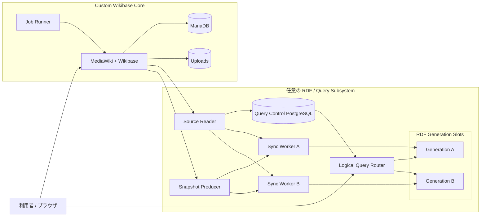

# Custom Wikibase

[English](README.md)

Custom Wikibaseは、研究・知識グラフ用途に向けた、交換可能なRDF backendを備えるカスタマイズ可能なWikibaseディストリビューションです。

MediaWikiとWikibaseに日本語向けの既定値を組み合わせています。MediaWiki/Wikibaseが正本であり、RDF query serviceは派生データを扱う任意コンポーネントです。Core-only modeと3つの交換可能なquery profileを提供します。

- Virtuoso Open Sourceはv0.1の既定backendです。
- Apache Jena Fuseki/TDB2はreference backendです。
- Oxigraphはlightweight backendです。

logical Query Routerがclientと物理RDF generationを分離します。snapshotとincremental synchronizationは同じcanonical Wikibase RDF normalization contractを使用し、検証済みgenerationのpromotionとrollbackを支援します。

現在の`0.1.0-rc.1`はApple Silicon/ARM64でローカルqualification済みです。AMD64用build inputは用意されていますが、AMD64 runtime qualificationは未完了です。これはrelease candidateであり、production readinessの宣言ではありません。[qualification](docs/japan-wikibase/qualification.md)、[既知の制約](docs/japan-wikibase/known-limitations.ja.md)、[`jwb-runtime-v1`](docs/japan-wikibase/runtime-contract.md)も参照してください。

## システム構成



MediaWiki/Wikibase、MariaDB、uploadsが正本となるコンテンツを保持します。任意のquery subsystemは、再構築可能な派生RDF indexを生成します。Query Control PostgreSQLが保持するのは同期・generation制御状態であり、正本となるWikibase entityではありません。

**RDF generation**とはquery subsystemが使用する物理RDF indexであり、MediaWikiのrevision historyではありません。2つのgeneration slotにより、候補indexを再構築・検証してから安定したlogical SPARQL endpointを切り替え、rollback generationも保持できます。

Standalone query profileは両方のgeneration slotに対して1種類のbackend実装を選択します。通常profileで3製品が同時稼働するわけではありません。

| Backend | 状態 | 役割 |
|---|---|---|
| Virtuoso | Supported | Default |
| Fuseki/TDB2 | Supported | Reference |
| Oxigraph | Supported | Lightweight |
| Blazegraph/WDQS | External compatibility | 既存Wikibase Suite互換 |

Core-only modeでは、MediaWiki/Wikibase、MariaDB、uploads、Job Runnerを`queryService.enabled = false`で実行します。PostgreSQLとRDF serviceは不要です。詳しいRDF同期とgeneration lifecycleは[アーキテクチャ概要](docs/architecture/overview.ja.md)を参照してください。

## クイックスタート

Docker Desktopではlocal `desktop-linux` contextを使用してください。製品コマンドはそれ以外のcontextを拒否します。

```sh
npm install --ignore-scripts
npm run jwb:create -- --backend=none
npm run jwb:test
npm run jwb:destroy
```

query backendを有効にする場合は、`none`の代わりに`virtuoso`、`fuseki-tdb2`、または`oxigraph`を選択します。runtime設定とresource sizingは、文書化されたCompose環境設定で変更できます。

Repository: <https://github.com/hirokiu/custom-wikibase>

本プロジェクトはWikibase Federation Platform monorepo内でJapan Wikibaseという歴史的名称を用いて開発されました。追跡可能性のため、過去のADR identifier、runtime identifier、qualification label、evidence名は維持されています。

## ライセンス

オリジナルsoftware codeはGPL-2.0-or-later、オリジナルproject documentationはCC BY 4.0です。upstream由来の素材にはそれぞれのupstream licenseが適用されます。[文書ライセンス](docs/LICENSING.ja.md)と[third-party notices](docs/japan-wikibase/third-party-notices.md)を参照してください。

## ドキュメント

- [アーキテクチャ](docs/architecture/overview.ja.md)
- [RDF同期とbackend support](docs/architecture/overview.ja.md#rdf同期)
- [Backend support](docs/architecture/overview.ja.md#backend-profile)
- [ライセンス](docs/LICENSING.ja.md)
- [既知の制約](docs/japan-wikibase/known-limitations.ja.md)
