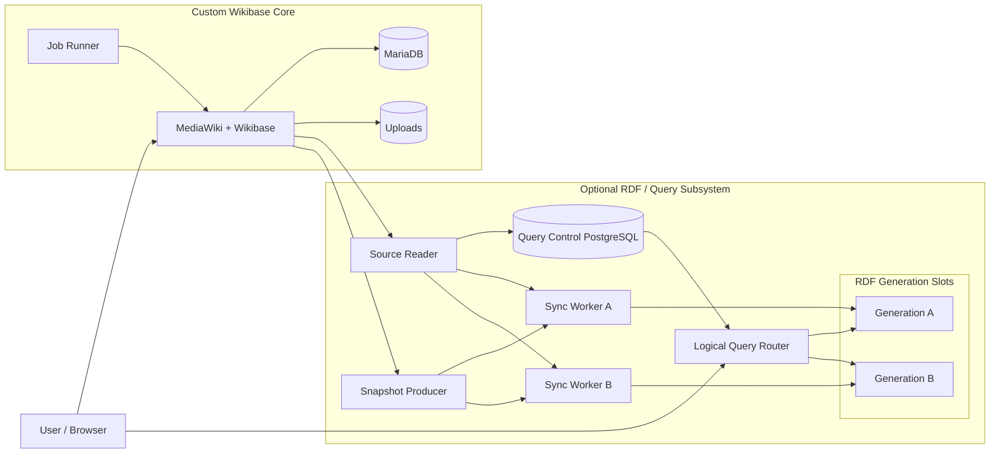

# Custom Wikibase

[日本語](README.ja.md)

A customizable Wikibase distribution with pluggable RDF backends for research and knowledge graph projects.

Custom Wikibase combines MediaWiki and Wikibase with Japanese-friendly defaults. MediaWiki/Wikibase remains the canonical source of truth; RDF query services are derived, optional components. The distribution supports Core-only mode and three interchangeable query profiles:

- Virtuoso Open Source is the v0.1 default backend.
- Apache Jena Fuseki/TDB2 is the reference backend.
- Oxigraph is the lightweight backend.

A logical Query Router separates clients from physical RDF generations. Snapshot and incremental synchronization share the same canonical Wikibase RDF normalization contract and support validated generation promotion and rollback.

The current `0.1.0-rc.1` candidate is qualified locally on Apple Silicon/ARM64. AMD64 build inputs are prepared, but AMD64 runtime qualification remains pending. It is a release candidate, not a claim of production readiness. See [qualification](docs/japan-wikibase/qualification.md), [known limitations](docs/japan-wikibase/known-limitations.md), and the [`jwb-runtime-v1`](docs/japan-wikibase/runtime-contract.md) contract.

## Architecture



MediaWiki/Wikibase, MariaDB, and uploads hold the authoritative content. The optional query subsystem creates rebuildable, derived RDF indexes. Query Control PostgreSQL stores synchronization and generation control state; it never stores authoritative Wikibase entities.

An **RDF generation** is a physical RDF index used by the query subsystem, not MediaWiki revision history. Two generation slots allow a candidate index to be rebuilt and validated before the stable logical SPARQL endpoint switches to it, while retaining a rollback generation.

Each standalone query profile selects one backend implementation for both generation slots; the three products do not run simultaneously in a normal profile.

| Backend | Status | Role |
|---|---|---|
| Virtuoso | Supported | Default |
| Fuseki/TDB2 | Supported | Reference |
| Oxigraph | Supported | Lightweight |
| Blazegraph/WDQS | External compatibility | Existing Wikibase Suite compatibility |

Core-only mode runs MediaWiki/Wikibase, MariaDB, uploads, and the Job Runner with `queryService.enabled = false`; PostgreSQL and RDF services are not required. See the [architecture overview](docs/architecture/overview.md) for the detailed RDF synchronization and generation lifecycle.

## Quick start

Docker Desktop must use the local `desktop-linux` context. Product commands reject other contexts.

```sh
npm install --ignore-scripts
npm run jwb:create -- --backend=none
npm run jwb:test
npm run jwb:destroy
```

Select `virtuoso`, `fuseki-tdb2`, or `oxigraph` instead of `none` to enable a query backend. Runtime configuration and sizing remain configurable through the documented Compose environment.

Repository: <https://github.com/hirokiu/custom-wikibase>

The project was developed under the historical name Japan Wikibase inside the Wikibase Federation Platform monorepo. Historical ADR identifiers, runtime identifiers, qualification labels, and evidence names are intentionally preserved for traceability.

## Licensing

Original software code is licensed under GPL-2.0-or-later. Original project documentation is licensed under CC BY 4.0. Upstream-derived material keeps its upstream license; see [documentation licensing](docs/LICENSING.md) and [third-party notices](docs/japan-wikibase/third-party-notices.md).

## Documentation

- [Architecture](docs/architecture/overview.md)
- [RDF synchronization and backend support](docs/architecture/overview.md#rdf-synchronization)
- [Backend support](docs/architecture/overview.md#backend-profiles)
- [Licensing](docs/LICENSING.md)
- [Known limitations](docs/japan-wikibase/known-limitations.md)
