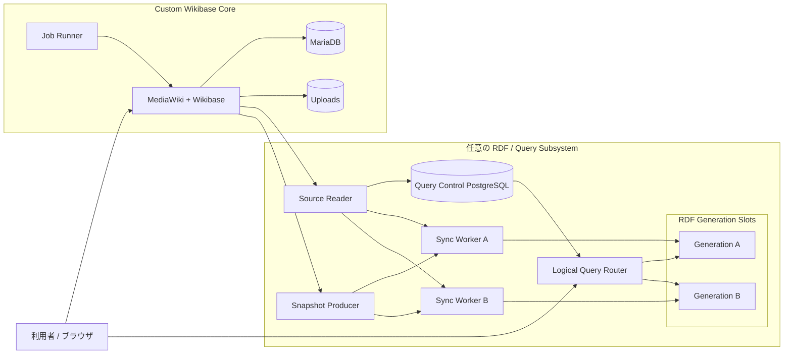
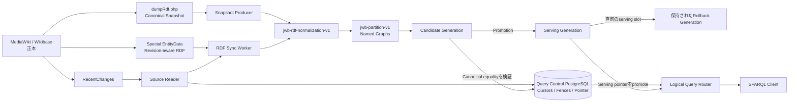

# Custom Wikibase アーキテクチャ

[English](overview.md)

この文書は、qualification済みの`0.1.0-rc.1` Standalone Composeアーキテクチャを説明します。Kubernetes固有の構成ではなく、製品の論理的な責務を示します。将来のKubernetes packageも同じ境界を実装できます。

## システム構成



MediaWiki/Wikibaseが正本です。query subsystemは任意であり、RDF datasetはWikibaseから再構築できます。Query Control PostgreSQLは同期とgeneration選択を調整しますが、entity storeではありません。

## Core-only profile

次の構成だけでも、完全にサポートされるdeploymentです。

```text
MediaWiki/Wikibase + MariaDB + Job Runner + Uploads
```

この場合は`queryService.enabled = false`を返します。Core-only運用では、Query Control PostgreSQL、Query Router、同期service、RDF backendは不要です。

## データの責務と復旧可能性

### 正本データ

- MariaDB内のMediaWiki/Wikibase entity・revision data
- uploadされたfile
- 安定したruntime identityと設定

これらは将来のproduction backup/restore contractで保護する必要があります。

### Query control state

- JWB PostgreSQLの同期cursorとrevision fence
- serving-generation pointer
- generation lifecycleとvalidation metadata

この状態は安全なquery cutoverを制御しますが、Wikibase entity dataを置き換えるものではありません。

### 派生・再構築可能データ

- Virtuoso、Fuseki/TDB2、またはOxigraphのRDF dataset
- candidate generationの内容
- 必要に応じて生成される一時snapshot artifact

派生データは、文書化された同期・validation protocolに従ってcanonical Wikibase dataから再構築できます。

## Generation用語

**Generation**とは、query subsystemが使用する物理RDF indexまたはdatasetです。MediaWikiのrevision historyではありません。MediaWiki revisionは正本となる編集履歴であり、RDF generationは独立して再構築可能なprojectionです。

Custom Wikibaseは2つの物理generation slotを保持します。非serving slotをload、catch up、validateした後で、logical Query Routerのserving pointerを切り替えます。直前のserving generationはrollback用に保持します。これにより、公開SPARQL URLを変更せずにatomicなlogical cutoverを実現します。

v0.1ではrollback generationを保持し、物理generationの自動削除は無効です。

## RDF同期



`dumpRdf.php`の`FULL_DUMP`出力と、revision-awareな`Special:EntityData`出力は、同じcanonical RDF projectionへnormalizeされます。`jwb-rdf-normalization-v1`を適用した後、`jwb-partition-v1`によってnamed graphへpartitionされます。

RecentChangesは順序付けされたsource cursorを提供します。revision fenceにより、重複、古い順序、out-of-order、gapを含むeventがdurable stateを暗黙に進めることを防ぎます。incremental writeはbackend updateの検証後にのみfenceを進めます。

rebuild時はsnapshotを非serving candidateへloadし、範囲を限定したincremental eventを適用してcanonical equalityを検証します。promotionはQuery Routerが利用するserving pointerを変更し、clientは同じlogical SPARQL URLを使い続けます。以前のserving generationはrollback用に保持されます。

## Backend profile

選択されたStandalone profileは、A/B両方のgeneration slotで1種類のbackend実装を動かします。Virtuoso、Fuseki/TDB2、Oxigraphは選択肢であり、3製品を同時に動かす構成ではありません。

| Backend | 状態 | 役割 |
|---|---|---|
| Virtuoso | Supported | v0.1 default |
| Fuseki/TDB2 | Supported | Reference implementation |
| Oxigraph | Supported | Lightweight implementation |
| Blazegraph/WDQS | External compatibility | 既存Wikibase Suite互換。Standalone v0.1 profileではない |

backend固有の管理endpointはprivateに保たれます。公開query boundaryはlogical Query Routerであり、公開SPARQL UPDATEは拒否されます。

## 関連ドキュメント

- [Backend guide](../japan-wikibase/backends.md)
- [Runtime contract](../japan-wikibase/runtime-contract.md)
- [Security and data ownership](../japan-wikibase/security.md)
- [既知の制約](../japan-wikibase/known-limitations.ja.md)
- [ライセンス](../LICENSING.ja.md)
