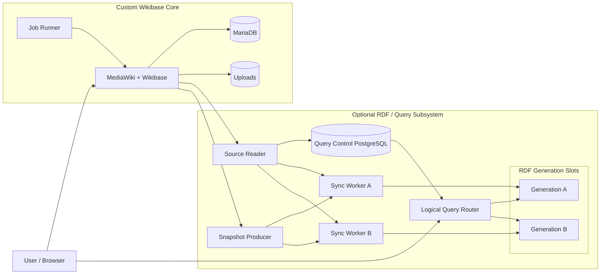
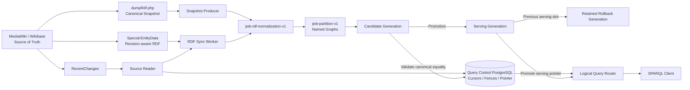

# Custom Wikibase architecture

[日本語](overview.ja.md)

This document describes the qualified `0.1.0-rc.1` standalone Compose architecture. It describes logical product responsibilities rather than a Kubernetes deployment. A future Kubernetes package may implement the same boundaries.

## System architecture



MediaWiki/Wikibase is the source of truth. The query subsystem is optional and its RDF datasets can be rebuilt from Wikibase. Query Control PostgreSQL coordinates synchronization and generation selection; it is not an entity store.

## Core-only profile

A complete supported deployment can contain only:

```text
MediaWiki/Wikibase + MariaDB + Job Runner + Uploads
```

It reports `queryService.enabled = false`. Query Control PostgreSQL, the Query Router, synchronization services, and RDF backends are not required for Core-only operation.

## Data ownership and recoverability

### Authoritative

- MediaWiki/Wikibase entity and revision data in MariaDB
- uploaded files
- stable runtime identity and configuration

These assets must be covered by a future production backup/restore contract.

### Query control state

- JWB PostgreSQL synchronization cursors and revision fences
- serving-generation pointer
- generation lifecycle and validation metadata

This state controls a safe query cutover, but does not replace Wikibase entity data.

### Derived and rebuildable

- Virtuoso, Fuseki/TDB2, or Oxigraph RDF datasets
- candidate generation content
- temporary snapshot artifacts where applicable

Derived data can be reconstructed from canonical Wikibase data, subject to the documented synchronization and validation protocol.

## Generation terminology

A **generation** is a physical RDF index or dataset used by the query subsystem. It is not MediaWiki revision history. MediaWiki revisions remain the authoritative edit history, while RDF generations are independently rebuildable projections.

Custom Wikibase keeps two physical generation slots. The non-serving slot can be loaded, caught up, and validated before the logical Query Router switches its serving pointer. The prior serving generation remains available for rollback. This provides an atomic logical cutover without changing the public SPARQL URL.

In v0.1, the rollback generation is retained and automatic physical generation deletion is disabled.

## RDF synchronization



`FULL_DUMP` output from `dumpRdf.php` and revision-aware `Special:EntityData` output are normalized to the same canonical RDF projection. After applying `jwb-rdf-normalization-v1`, the projection is partitioned into named graphs using `jwb-partition-v1`.

RecentChanges supplies an ordered source cursor. Revision fencing prevents duplicate, stale, out-of-order, or gapped events from silently advancing durable state. Incremental writes advance their fence only after the backend update is verified.

During rebuild, the snapshot is loaded into the non-serving candidate, bounded incremental events are applied, and canonical equality is validated. Promotion changes the serving pointer used by the Query Router; clients continue to use the same logical SPARQL URL. The former serving generation is retained for rollback.

## Backend profiles

The selected standalone profile runs one backend implementation across both A/B generation slots. Virtuoso, Fuseki/TDB2, and Oxigraph are alternatives, not three simultaneously running stores.

| Backend | Status | Role |
|---|---|---|
| Virtuoso | Supported | v0.1 default |
| Fuseki/TDB2 | Supported | Reference implementation |
| Oxigraph | Supported | Lightweight implementation |
| Blazegraph/WDQS | External compatibility | Existing Wikibase Suite compatibility; not a standalone v0.1 profile |

Backend-specific administration endpoints remain private. The public query boundary is the logical Query Router, and public SPARQL UPDATE is rejected.

## Related documentation

- [Backend guide](../japan-wikibase/backends.md)
- [Runtime contract](../japan-wikibase/runtime-contract.md)
- [Security and data ownership](../japan-wikibase/security.md)
- [Known limitations](../japan-wikibase/known-limitations.md)
- [Licensing](../LICENSING.md)
